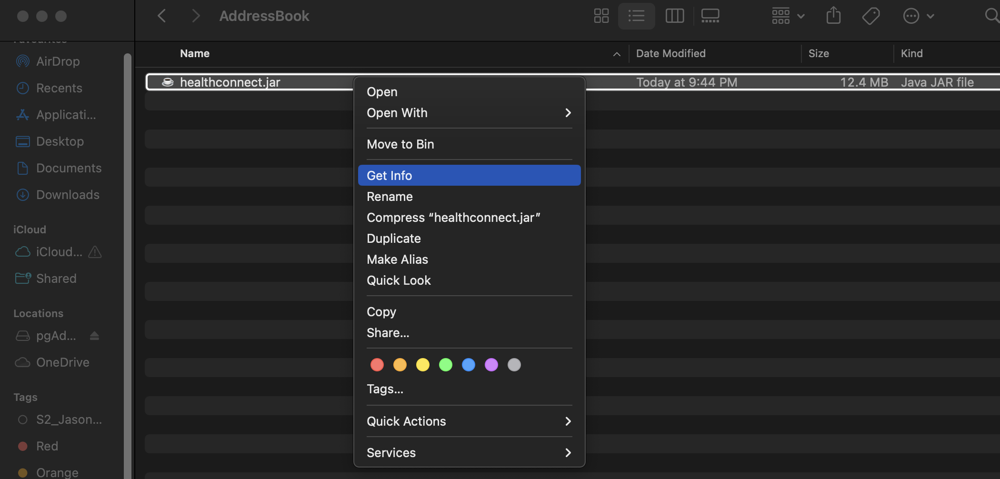
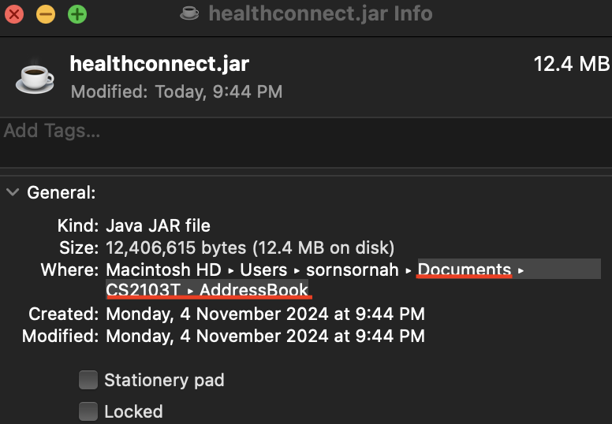
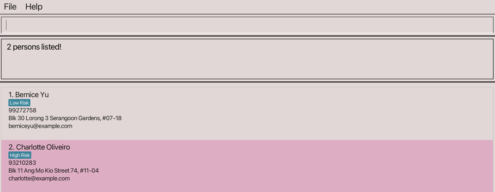
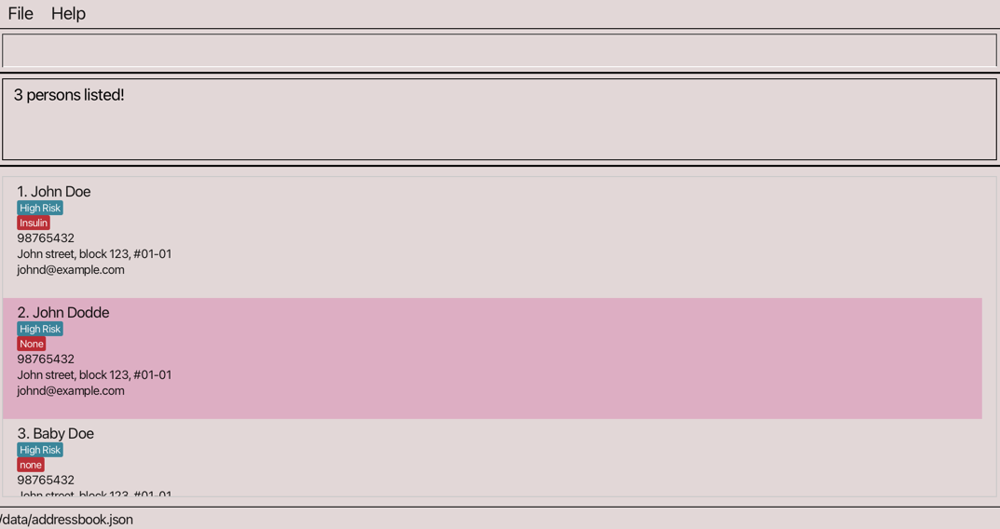
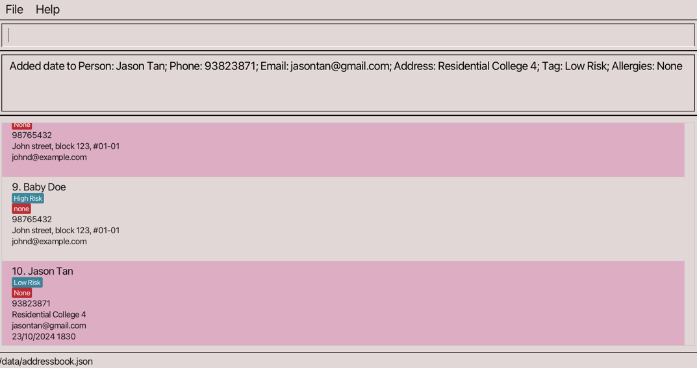
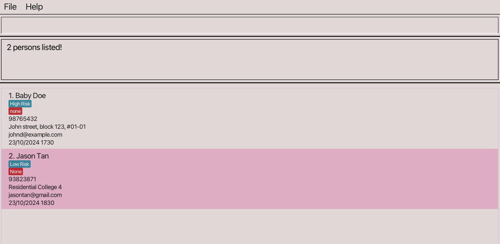
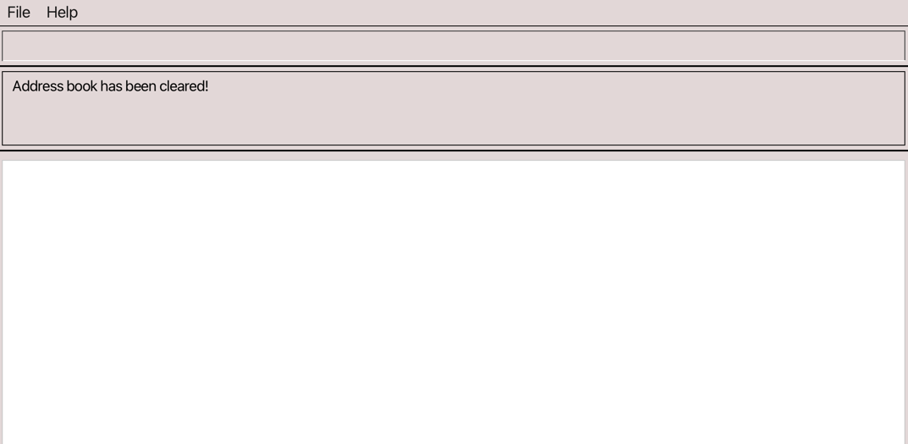

# Health Connect
Health Connect is an application designed to **streamline client management** for Singapore based healthcare professionals. It allows users to **efficiently track client details and appointments**, simplifying the management process.

--------------------------------------------------------------------------------------------------------------------
## Table of Contents
1. [Quick Start](#quick-start)
    1. [For Windows Users](#for-windows-users)
    2. [For Mac Users](#for-mac-users)
2. [Features](#features)
   1. [Command Format](#command-format)
   2. [Parameter Constraints](#parameter-constraints)
   3. [Viewing Help: `help`](#viewing-help-help)
   4. [Adding a Person: `add`](#adding-a-patient-add)
   5. [Viewing All Patients `view`](#viewing-all-patients-view)
   6. [Editing a Patient: `edit`](#editing-a-patient--edit)
   7. [Locating Patients by Name: `find`](#locating-patients-by-name-find)
   8. [Locating Patients by Features: `filter`](#locating-patients-by-different-parameters-filter)
   9. [Deleting a Patient: `delete`](#deleting-a-patient--delete)
   10. [Adding Or Updating Appointment Date and Time to Patient: `date`](#adding-or-updating-an-appointment-date-and-time-to-a-person--date)
   11. [Seeing the Schedule for the Day: `schedule`](#seeing-the-schedule-for-the-day-schedule)
   12. [Clearing All Entries: `clear`](#clearing-all-entries--clear)
   13. [Exiting the Program: `exit`](#exiting-the-program--exit)
3. [Data](#data)
    1. [Saving the Data File](#saving-the-data)
    2. [Editing the Data File](#editing-the-data-file)
4. [FAQ](#faq)
5. [Known Issues](#known-issues)
6. [Command Summary](#command-summary)

--------------------------------------------------------------------------------------------------------------------
## Quick Start

### For Windows Users:
1. Ensure you have Java `17` or above installed in your Computer.
    1. Open Command Prompt. You can do this by clicking the Windows Start or Search button and type `cmd`.
       
    2. Once Command Prompt is open, type: `java -version` and click `Enter`.
       
    3. If Java `17` or higher is displayed, you are good to go! Proceed to **Step 3**.
       
    4. Otherwise, proceed to **Step 2**.
        
2. If you do not have Java `17` or above from the previous step, install the correct version of Java.
    1. Proceed to the [official website](https://www.oracle.com/java/technologies/javase/jdk17-archive-downloads.html) to download Java `17`.
    2. Download the appropriate installer for Windows.
    3. After installation, follow the instructions in **Step 1**.
        
3. Download the latest jar file [here](https://github.com/AY2425S1-CS2103T-T11-4/tp/releases/latest).
    
4. Copy the file to the folder you want to use as the _home folder_ for your AddressBook.
    
5. Use Command Prompt to open the JAR file.
    1. Find the file path of the file you just copied. To do so, right-click on the file in the folder and press `Properties`.
       
    2. Check the File Path by noticing the path after your username under **Location**.
       
       For example, in this case, the required `FILEPATH` will be `OneDrive/Documents/CS2103T/AddressBook`
    3. In Command Prompt, enter `cd FILEPATH`, replacing `FILEPATH` with your own path obtained. Following the previous example, you should enter `cd OneDrive/Documents/CS2103T/AddressBook` as follows:
       
    4. In Command Prompt, enter `java -jar healthconnect.jar`.
       
    5. A GUI similar to the below should appear in a few seconds.
       
        
6. Type the command in the command box and press Enter to execute it. e.g. typing **`help`** and pressing Enter will open the help window. 
   Some example commands you can try:
    * `view`: Displays all contacts.
    * `add n/John Doe p/98765432 e/johnd@example.com a/John street, block 123, #01-01 t/High Risk m/Wheat`: Adds a contact named `John Doe` to the Address Book.
    * `filter t/High Risk`: Displays all entries which are tagged High Risk.
    * `clear`: Deletes all contacts.
    * `exit`: Exits the app.
       
7. Refer to the [Features](#features) below for details of each command.

### For Mac Users:
1. Ensure you have Java `17` or above installed in your Computer.
    1. Open Terminal. You can do this by searching for it using Spotlight Search. To do so, press `Command + Space` and search "Terminal".
       
    2. Once Terminal is open, type: `java -version` and click `Enter`.
       
    3. If Java `17` or higher is displayed, you are good to go! Proceed to **step 3**.
       
    4. Otherwise, proceed to step 2.
        
2. If you do not have Java `17` or above from the previous step, install the correct version of Java.
    1. Proceed to the [official website](https://www.oracle.com/java/technologies/javase/jdk17-archive-downloads.html) to download Java `17`: https://www.oracle.com/java/technologies/javase/jdk17-archive-downloads.html
    2. Download the appropriate installer for Mac.
    3. After installation, follow the instructions in **Step 1**.
        
3. Download the latest jar file [here](https://github.com/AY2425S1-CS2103T-T11-4/tp/releases/latest).
    
4. Copy the file to the folder you want to use as the _home folder_ for your AddressBook.
    
5. Use Terminal to open the JAR file.
    1. Find the file path of the file you just copied. To do so, right-click on the file in Finder and press `Get Info`.
       
    2. Check the File Path by noting the path after your username under **Where**.
       
       For example, in this case, the required `FILEPATH` will be `Documents/CS2103T/AddressBook`
    3. In Terminal, enter `cd FILEPATH`, replacing `FILEPATH` with your own path obtained. Following the previous example, you should enter `cd Documents/CS2103T/AddressBook` as follows:
       
    4. In Terminal, enter `java -jar healthconnect.jar`.
       
    5. A GUI similar to the below should appear in a few seconds.
       
        
6. Type the command in the command box and press Enter to execute it. e.g. typing **`help`** and pressing Enter will open the help window. 
   Some example commands you can try:
    * `view`: Displays all contacts.
    * `add n/John Doe p/98765432 e/johnd@example.com a/John street, block 123, #01-01 t/High Risk m/Wheat`: Adds a contact named `John Doe` to the Address Book.
    * `filter t/High Risk`: Displays all entries which are tagged High Risk.
    * `clear`: Deletes all contacts.
    * `exit`: Exits the app.
       
7. Refer to the [Features](#features) below for details of each command.

--------------------------------------------------------------------------------------------------------------------

## Features

### Command Format

* Words in `UPPER_CASE` are the parameters to be supplied by the user. 
  e.g. in `add n/NAME`, `NAME` is a parameter which can be used as `add n/John Doe`.

* Items in square brackets are optional. 
  e.g `n/NAME [p/PHONE]` can be used as `n/John Doe p/98765432` or as `n/John Doe`.

* Parameters can be in any order. 
  e.g. if the command specifies `n/NAME p/PHONE`, `p/PHONE n/NAME` is also acceptable.

* Extraneous parameters for commands that do not take in parameters (such as `help`, `view`, `exit` and `clear`) will be ignored. 
  e.g. If the command specifies `help 123`, it will be interpreted as `help`.

* Prefixes are case sensitive, and must be in lower case.  
  e.g. `n/` is allowed but `N/` is not allowed

* If you are using a PDF version of this document, be careful when copying and pasting commands that span multiple lines as space characters surrounding line-breaks may be omitted when copied over to the application.

* The following are considered duplicate patients:
  * Same name AND same phone number
  * Same name AND same email
  * Same name, same phone number AND same email
  * Note: same phone number AND same email are not considered as a duplicate patient since the patient might use their Next Of Kin's contact details

### Parameter Constraints

* **NAME**
    - The string must be alphanumeric and contain at least one alphabetic character (i.e., it cannot consist entirely of numbers). Special characters allowed are space (' '), slash ('/'), and hyphen ('-').
  
* **PHONE**
    - Must be exactly 8 digits long and start with 3, 6, 8 or 9 (adhering to Singapore phone numbers).
    - Only numeric characters are allowed
  
* **EMAIL**
    - Must follow a valid email format and include a domain [name]@[domain].[TLD] e.g. `name@example.com`
    - Can contain alphanumeric characters and special characters such as underscore `_`, period `.` and hyphens `-` before the `@` symbol

* **TAG**
    - A patient must have one of the following priority tags:
        1. `High Risk`
        2. `Medium Risk`
        3. `Low Risk`
      
* **ALLERGY**
    - Only include alphanumeric characters, spaces, and commas.
    - Must not be empty or contain special characters other than commas and spaces.
    - If a patient has multiple allergies, they can be listed in the add command like this: `m/Allergy1 m/Allergy2`
    - If a patient has no allergies, use this format: `m/None`
      
* **INDEX**
    - Must be a positive integer: 1, 2, 3, ...
    - Must be an index number shown in the displayed patient list

* **DATE_TIME**
    - Follows the format of d/M/yyyy HHmm
    - Can only contain numbers, '/', and spaces.

* **DATE**
    - Follows the format of d/M/yyyy
    - Can only contain numbers and '/'

### Viewing help: `help`

Shows a message explaining how to access the help page.

Format: `help`

### Adding a patient: `add`

Adds a patient to the address book.

Format: `add n/NAME p/PHONE e/EMAIL a/ADDRESS t/TAG m/ALLERGY...` 

[Parameter Constraints](#parameter-constraints): `NAME`, `PHONE`, `EMAIL`, `ADDRESS`, `TAG`, `ALLERGY`

Examples:

* `add n/John Doe p/98765432 e/johnd@example.com a/John street, block 123, #01-01 t/High Risk m/Lactose m/Gluten`

* `add n/John Doe p/98765432 e/johnd@example.com a/John street, block 123, #01-01 t/High Risk m/Insulin m/Penicillin`
  
* `add n/Betsy-Crowe p/81239873 e/betsycrowe@example.com a/01 Clementi Road #04-03 Singapore 4374538 t/Low Risk m/None`

### Viewing all patients: `view`

Shows a list of all patients in the address book.

Format: `view`

### Editing a patient : `edit`

Edits an existing patient in the address book.

Format: `edit INDEX [n/NAME] [p/PHONE] [e/EMAIL] [a/ADDRESS] [t/TAG] [m/ALLERGY]...`

[Parameter Constraints](#parameter-constraints): `NAME`, `PHONE`, `EMAIL`, `ADDRESS`, `TAG`, `ALLERGY`

Additional Details:
* Edits the person at the specified `INDEX`. The index refers to the index number shown in the displayed person list.
* **At least one of the optional fields must be provided**.
* Existing values will be updated to the input values.
* When editing tags, the existing tags of the person will be removed i.e adding of tags is not cumulative.
* You can remove all the person’s tags by typing `t/` without specifying any tags after it.

Examples:
*  `edit 1 p/91234567 e/johndoe@example.com` Edits the phone number and email address of the 1st person to be `91234567` and `johndoe@example.com` respectively.
    
* `edit 2 n/Betsy Crower`
  Edits the name of the 2nd person to be `Betsy Crower`.

### Locating patients by name: `find`

Finds patients whose names contain any of the given keywords.

Format: `find KEYWORD [MORE_KEYWORDS]`

[Parameter Constraints](#parameter-constraints): `NAME`

Additional Details:
* The search is case-insensitive. e.g `hans` will match `Hans`
* The order of the keywords does not matter. e.g. `Hans Bo` will match `Bo Hans`
* Only the name is searched.
* Only full words will be matched e.g. `Han` will not match `Hans`
* Persons matching at least one keyword will be returned (i.e. `OR` search).
  e.g. `Hans Bo` will return `Hans Gruber`, `Bo Yang`

Examples:
* `find John`
  Returns `John` and `John Doe`
   
* `find bernice charlotte` Returns `Bernice` and `Charlotte`
  
  

### Locating patients by different parameters: `filter`

Filters the list to return patients who have the given features.

Format: `filter PREFIX/FEATURE_NAME [PREFIX/FEATURE_NAME]`

[Parameter Constraints](#parameter-constraints):`PHONE`, `EMAIL`, `ADDRESS`, `TAG`, `ALLERGY`

Additional Details:
* The search is case-sensitive.
* The order of the features does not matter. e.g. `t/ High Risk p/99999999` will match `p/99999999 t/ High Risk `
* You can filter by **tag, email, allergy, address, phone number and allergies**
* Only full words will be matched e.g. `99999999` will not match `999`
* Allergies is the only attribute that allows multiple parameters. For other attributes, there can only be one of each feature as a maximum (i.e. cannot filter by two tags (eg. ‘filter t/ High Risk t/Low Risk’ is considered invalid format and not accepted.
* The filter search uses AND logic between different attributes (e.g., tag and allergies) — all specified attributes must match. If multiple allergies are specified, it uses OR logic — an entry will match allergies attribute if it has any one of the specified allergies, or all. 
For example:
filter t/High Risk m/Peanuts m/Dairy will return entries with the "High Risk" tag and any of the allergies "Peanuts" or "Dairy".
filter m/Peanuts m/Dairy will return entries with either "Peanuts" or "Dairy" allergy, or both.
* Filter requires at least one feature to filter by (e.g. ‘filter’ is an invalid format but ‘filter t/High Risk’ and ‘filter p/99999999’ are both accepted.
  e.g. `t/ High Risk p/99999999` will return all patients with tag `High Risk` and phone number `99999999`

Examples:
* `filter t/High Risk a/John street, block 123, #01-01` 
* returns all patients who are at high risk AND have address `John street, block 123, #01-01`
  
   
* `filter m/Penicillin p/88451234`
  returns all patients who have an allergy to penicillin AND have the phone number `88451234`
   

### Deleting a patient : `delete`

Deletes the specified patient from the address book.

Format: `delete [n/NAME] [p/PHONE] [e/EMAIL]`

[Parameter Constraints](#parameter-constraints): `NAME`, `PHONE`, `EMAIL`

Additional Details:
- Deletes the person that matches the following NAME, PHONE and/or EMAIL
- If the NAME cannot uniquely identify the patient, then more details (e.g. PHONE or EMAIL) need to be provided.

Examples:
* `delete n/john`
  Deletes `John` assuming that there is only 1 `John` in the address book.
   
* `delete n/craig p/98761230`
  Deletes `Craig` with phone `98761230` assuming that there is only 1 patient with name `Craig` and phone `98761230` in the address book

### Adding or updating an appointment date and time to a person : `date`

Adds or updates the appointment date and time of the specified person in the address book. This for easy reference, so past appointments can be entered.

Format: `date [n/NAME] [p/PHONE] [e/EMAIL] d/DATE_TIME`

[Parameter Constraints](#parameter-constraints): `NAME`, `PHONE`, `EMAIL`, `DATE_TIME`

Additional Details:
* Adds or updates the next appointment date and time of person that uniquely matches at least one of the following three attributes `NAME`, `PHONE` and `EMAIL`
* If the attribute provided matches more than one person, more attributes need to be provided to uniquely match to a person
* To remove the date and time from a person, use `d/None` in the command.
* 2 patients cannot have the same date and time for the appointment
* When no date and time is set, no date and time is displayed.
* In the command format, the brackets around `n/NAME`, `p/PHONE`, and `e/EMAIL` indicate that these fields are flexible in their order and selection. 
This does not mean that all three fields can be left out. 
Instead, it allows the user to include any one or more of these fields, but at least one must be provided. 
This flexibility helps in cases where only one of these details is available or relevant, but still ensures there is enough information to uniquely identify a contact.
* This feature supports the year 0001 onwards. Any years before that is not supported.
* The month must be between 1 and 12.
* The day must match the number of dates in a month. This takes into account months when there are only 30 days and February when there are 28 or 29 days, depending on if it is a leap year.
* The time is in the 24-hour format. (e.g. 1800 for 6:00 PM)
* The format of the date and time, as well the values must be valid, or there will be an error. Note that, to allow fast typing and avoid unnecessary inconvenience, leading zeroes for day and month is allowed in the format and will be parsed. 
(e.g. 01/01/2024 1400 will be parsed the same way as 1/1/2024 1400)
* For consistency and ease of validation, spaces between slashes in the date (e.g., 1 / 1 / 2024) are not allowed. This ensures that all dates are uniformly formatted, which helps prevent errors and speeds up processing. Please enter dates without spaces, such as 1/1/2024 or 01/01/2024.
* The app allows users to enter dates and times that are in the past to provide flexibility in managing and storing patient information. This feature prevents unnecessary limitations, enabling healthcare professionals to record historical data, update past appointments, and maintain a comprehensive record of all patient interactions, even those that have already occurred.

Examples:
* `date n/Jason Tan p/93823871 e/jasontan@gmail.com d/23/10/2024 1830`
  
  Adds appointment date and time `23/10/2024 1830` to patient with name:`Jason Tan`, phone:`93823871`, email:`jasontan@gmail.com`
   
* `date p/92938132 d/22/10/2024 1920`
  Adds appointment date and time `22/10/2024 1920` to patient with phone:`92938132`
   
* `date e/johndoe@gmail.com d/10/02/2023 1520`
  Adds appointment date and time `10/02/2023 1520` to patient with email `johndoe@gmail.com`
   
* `date n/Alex Yeoh d/None`
  Removes appointment date from `Alex Yeoh`

### Seeing the schedule for the day: `schedule`

Filters the list to return patients who have an appointment of the given day.  
(i.e. shows the healthcare professional's schedule for the day)

Format: `schedule d/DATE`

[Parameter Constraints](#parameter-constraints): `DATE`

Additional Details:
* Date in the `schedule` feature differs from the date in the `date` feature.
* Date in the `schedule` feature does not accept a time.
* All patients with an appointment date on that given day will be listed regardless of what their appointment time is.
* Refer to additional details under the [appointment date feature](#adding-or-updating-an-appointment-date-and-time-to-a-person--date) above for details on the date format and valid values.  

Examples:
* `schedule d/23/10/2024`
  
  returns all patients with appointment date on 23rd October 2024

### Clearing all entries : `clear`

Clears all entries from the address book.

Format: `clear`

### Exiting the program : `exit`

Exits the program.

Format: `exit`

--------------------------------------------------------------------------------------------------------------------
## Data

### Saving the data

AddressBook data are saved in the hard disk automatically after any command that changes the data. There is no need to save manually.

### Editing the data file

AddressBook data are saved automatically as a JSON file `[JAR file location]/data/addressbook.json`. Advanced users are welcome to update data directly by editing that data file.

If your changes to the data file makes its format invalid, AddressBook will discard all data and start with an empty data file at the next run. Hence, it is recommended to take a backup of the file before editing it. 
Furthermore, certain edits can cause the AddressBook to behave in unexpected ways (e.g., if a value entered is outside of the acceptable range). Therefore, edit the data file only if you are confident that you can update it correctly.

--------------------------------------------------------------------------------------------------------------------

## FAQ

**Q**: How do I transfer my data to another Computer? 
**A**: Install the app in the other computer by following the instructions in [Quick Start](#quick-start) and overwrite the empty data file it creates with the file that contains the data of your previous AddressBook home folder.
1. Find the `data` folder created by the application
   
    
2. Transfer the `.json` file in the `data folder
   
--------------------------------------------------------------------------------------------------------------------

## Known Issues

**Issue 1:** **When using multiple screens**, if you move the application to a secondary screen, and later switch to using only the primary screen, the GUI will open off-screen.  
**Remedy:** Delete the `preferences.json` file created by the application **in the same folder** before running the application again.

 
**Issue 2:** **If you minimize the Help Window** and then run the `help` command again, the original Help Window will remain minimized, and no new Help Window will appear. 
**Remedy:** Manually restore the minimized Help Window.

--------------------------------------------------------------------------------------------------------------------

## Command Summary
| Action   | Format & Examples                                                                   | Examples                                                                                  |
|----------|-------------------------------------------------------------------------------------|-------------------------------------------------------------------------------------------|
| Add      | `add n/NAME p/PHONE e/EMAIL a/ADDRESS t/TAG m/ALLERGY...`                    | `add n/James Ho p/98765432 e/jamesho@example.com a/123 Clementi Rd t/High Risk m/peanuts` |
| Edit     | `edit INDEX [n/NAME] [p/PHONE] [e/EMAIL] [a/ADDRESS] [t/TAG] [m/ALLERGY]...` | `edit 2 n/James Lee e/jameslee@example.com`                                               |
| Delete   | `delete [n/NAME] [p/PHONE] [e/EMAIL]`                                               | `delete n/Nayana p/98765432 e/nayana@gmail.com`                                           |
| Clear    | `clear`                                                                             | -                                                                                         |
| View     | `view`                                                                              | -                                                                                         |
| Find     | `find KEYWORD [MORE_KEYWORDS]`                                                      | `find James Jake`                                                                         | 
| Filter   | `filter PREFIX/FEATURE_NAME [PREFIX/FEATURE_NAME]`                                  | `filter t/High Risk`                                                                      |
| Date     | `date [n/NAME] [p/PHONE] [e/EMAIL] d/DATE_TIME`                                     | `date n/Jason Tan p/93823871 e/jasontan@gmail.com d/23/10/2024 1830`                                                                                          |
| Schedule | `schedule d/DATE`                                                                   | `schedule d/23/10/2024`                                                                                          |
| Exit     | `exit`                                                                              | -                                                                                         |
| Help     | `help`                                                                              | -                                                                                         |

--------------------------------------------------------------------------------------------------------------------
